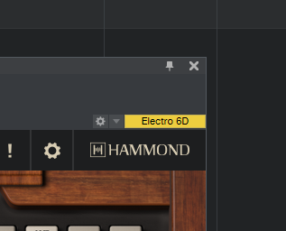
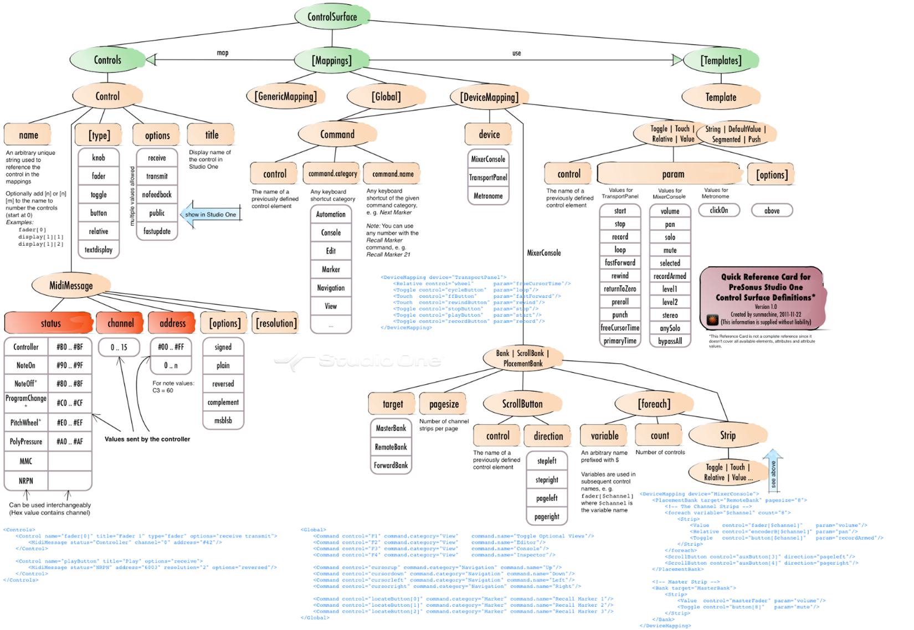

# About

This is a living document to detail information about Presonus Studio One surface.XML / device mapping files.

## Pre-read

First, you must understand about Studio One's ***"Focus mode"***. You can avoid remapping your MIDI controller for every song, but the behavior is not intuitive. If you are in focus mode the mapping works as long as your plugin window **is in focus.** Additionally, the mapping between your hardware knob and plugin parameter is retained between songs. Reference <https://www.youtube.com/watch?v=Vq0GMDvagi4>

*Yellow button on in the upper right hand corner of the plugin window indicates focus mode.*

When you are in global mode (same button is not yellow), your MIDI knobs continue to control the plugin even if its window is not in focus.

Presonus Studio One Surface/Device mapping cheatsheet 
